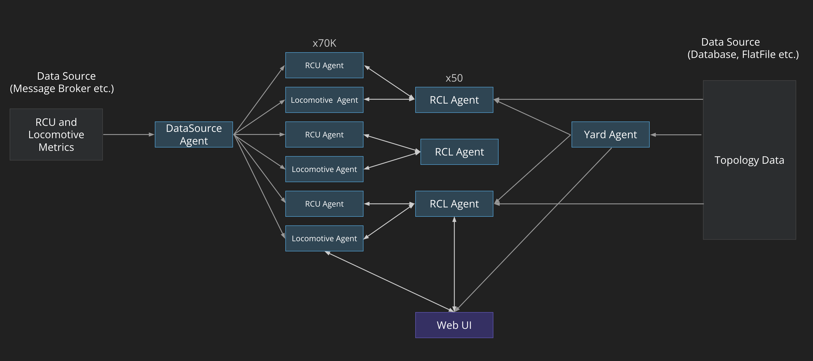

# Railroad Demo

A tutorial application for teaching core Swim concepts.  See a hosted version
of this app running at [https://railroad.nstream-demo.io](https://railroad.nstream-demo.io/).

## Architecture



### Goal of this Demo

* Demonstrate via a realistic mocked demo, how Nstream enables railroads and adjacent players to efficiently build their own solutions in their existing Java development stacks leveraging their streaming data sources with Nstream’s developer framework.
* This demo includes a map of the United States that can drill into cities with Rail yards and show the current and changing location and health status of the RCL assets on the Railroad track.

#### Details of terms in the Architecture Diagram

* RCU Agent
  * Loads metadata (id, RCL id)
  * Receives metrics  (CPU, Memory, Battery, Signal, Temp, Alerts) for a given RCU
  * Statefully models the current state of the RCU
  * Continuously analyzes and computes status as it changes in real-time
  * Retains a history of metric data
* Locomotive Agent
  * Loads metadata (id, RCL id)
  * Receives metrics  (Brake Level, Throttle, Engine Temperature, Location) for a given Locomotive 
  * Statefully models the current state of the Locomotive 
  * Continuously analyzes and computes status as it changes in real-time 
  * Retains a history of metric data
* RCL Agent
  * Loads metadata (id, yard id)
  * Receives the real-time state of the RCU and Locomotive that is associated with it 
  * Statefully models the current state of the RCL 
  * Continuously analyzes and computes status as it changes in real-time based on the RCU and Locomotive status
* Yard Agent
  * Loads metadata (yard id, name)
  * Receives the real-time state of every RCL unit that are in the yard 
  * Statefully models the current state of the Yard 
  * Continuously analyzes and computes new status based on all the RCL statuses as it changes in real-time

## Prerequisites

* [Install JDK 17+](https://www.oracle.com/technetwork/java/javase/downloads/index.html).
  * Ensure that your `JAVA_HOME` environment variable is pointed to your Java installation location.
  * Ensure that your `PATH` includes `$JAVA_HOME`.

* [Install Node.js](https://nodejs.org/en/).
  * Confirm that [npm](https://www.npmjs.com/get-npm) was installed during the Node.js installation.

## Repository Structure

### Key files

- [build.gradle](build.gradle) — backend project configuration script
- [gradle.properties](gradle.properties) — backend project configuration variables
- [package.json](ui/package.json) — frontend project configuration
- [rollup.config.js](ui/rollup.config.js) — frontend bundle configuration script

### Key directories

- [src](src) — backend source code, and configuration resources
  - [main/java](src/main/java) — backend source code
  - [main/resources](src/main/resources) — backend configuration resources
- [ui src](ui/src) — frontend source code
- [gradle](gradle) — support files for the `gradlew` build script


## Run

### Running on Linux or MacOS

```bash
$ ./gradlew run
```

### Viewing the UI
Open a web browser to [http://localhost:9001](http://localhost:9001).


## Streaming APIs
The Swim runtime exposes its internal subsystems as a set of meta web agents.

### "swim-cli" installation
**swim-cli** installation details available here: https://www.swimos.org/backend/cli/ 

### Application APIs
**Note:** 
* Below **swim-cli** commands for introspection are for streaming locally running application.
* There is a hosted version of this application running here: https://railroad.nstream-demo.io/
* To stream APIs for the hosted version, replace ```warp://localhost:9001``` in below commands with ```warps://railroad.nstream-demo.io``` 

1. **YARD**:

(Below, "Bailey" yard is used as an example)

* Yard Info - provides latitude and longitude of a particular yard
```
swim-cli sync -h warp://localhost:9001 -n /yard/Bailey -l info
```

* Yard Status - provides total number of warnings and alerts. 
```
swim-cli sync -h warp://localhost:9001 -n /yard/Bailey -l status
```

* Details of all the rails associated with the yard 
```
swim-cli sync -h warp://localhost:9001 -n /yard/Bailey -l rails
```

* Details of all the warnings associated with the yard
```
swim-cli sync -h warp://localhost:9001 -n /yard/Bailey -l warningRcls
```

* Details of all the alerts associated with the yard
```
swim-cli sync -h warp://localhost:9001 -n /yard/Bailey -l alertRcls
```

2. **RCLs**:

(Below, rcl "32" is used as an example)

* Info of the rcl fetched from the rcls csv file 
```
swim-cli sync -h warp://localhost:9001 -n /rcl/rcl32 -l info
```

* Current Status of the rcl
```
swim-cli sync -h warp://localhost:9001 -n /rcl/rcl32 -l status
```

* Current geographical coordinates of the rcl along-with related details
```
swim-cli sync -h warp://localhost:9001 -n /rcl/rcl32 -l geo
```

* Metrics of the rcl
```
swim-cli sync -h warp://localhost:9001 -n /rcl/rcl32 -l locomotiveMetrics
```

* Historical data of the rcl's metrics
```
swim-cli sync -h warp://localhost:9001 -n /rcl/rcl32 -l metricsHistory
```

* RCU metrics belonging to the rcl
```
swim-cli sync -h warp://localhost:9001 -n /rcl/rcl32 -l rcuMetrics
```

### Introspection APIs

Use the `swim:meta:host` agent to introspect a running host. Use the `pulse`
lane to stream high level stats:

```sh
swim-cli sync -h warp://localhost:9001 -n swim:meta:host -l pulse
```

The `nodes` lane enumerates all agents running on a host:

```sh
swim-cli sync -h warp://localhost:9001 -n swim:meta:host -l nodes
```

The fragment part of the `nodes` lane URI can contain a URI subpath filter:

```sh
swim-cli sync -h warp://localhost:9001 -n swim:meta:host -l nodes#/
```

#### Node Introspection

You can stream the utilization of an individual web agent:

```sh
swim-cli sync -h warp://localhost:9001 -n swim:meta:node/%2fyard%2fBailey -l pulse
swim-cli sync -h warp://localhost:9001 -n swim:meta:node/%2fyard%2fOakland -l pulse
swim-cli sync -h warp://localhost:9001 -n swim:meta:node/%2fyard%2fFortWorth -l pulse
swim-cli sync -h warp://localhost:9001 -n swim:meta:node/%2fyard%2fWestColton -l pulse
```

And discover its lanes:

```sh
swim-cli sync -h warp://localhost:9001 -n swim:meta:node/%2fyard%2fBailey -l lanes
swim-cli sync -h warp://localhost:9001 -n swim:meta:node/%2fyard%2fOakland -l lanes
swim-cli sync -h warp://localhost:9001 -n swim:meta:node/%2fyard%2fFortWorth -l lanes
swim-cli sync -h warp://localhost:9001 -n swim:meta:node/%2fyard%2fWestColton -l lanes
```

Some additional examples:

* Locomotive

```sh
swim-cli sync -h warp://localhost:9001 -n swim:meta:node/%2frcl%2frcl17 -l pulse
swim-cli sync -h warp://localhost:9001 -n swim:meta:node/%2frcl%2frcl17 -l lanes
```

* Introspection of details for Yards, Yard-Rails and Locomotive stored in CSV format

```sh
swim-cli sync -h warp://localhost:9001 -n swim:meta:node/%2fcsv%2fyard-rails -l pulse
swim-cli sync -h warp://localhost:9001 -n swim:meta:node/%2fcsv%2fyard-rails -l lanes

swim-cli sync -h warp://localhost:9001 -n swim:meta:node/%2fcsv%2fyards -l pulse
swim-cli sync -h warp://localhost:9001 -n swim:meta:node/%2fcsv%2fyards -l lanes

swim-cli sync -h warp://localhost:9001 -n swim:meta:node/%2fcsv%2frcls -l pulse
swim-cli sync -h warp://localhost:9001 -n swim:meta:node/%2fcsv%2frcls -l lanes
```

* Map coordinates

```sh
swim-cli sync -h warp://localhost:9001 -n swim:meta:node/%2fmap%2f84024,321683,19 -l pulse
swim-cli sync -h warp://localhost:9001 -n swim:meta:node/%2fmap%2f84024,321683,19 -l lanes
```

#### Mesh introspection

```sh
swim-cli sync -h warp://localhost:9001 -n swim:meta:edge -l meshes
```

#### Log introspection

You can stream log message for a particular web agent:

```sh
swim-cli sync -h warp://localhost:9001 -n swim:meta:node/%2fyard%2fBailey -l debugLog
```

Or stream all log messages for a host:

```sh
swim-cli sync -h warp://localhost:9001 -n swim:meta:host -l debugLog
```
